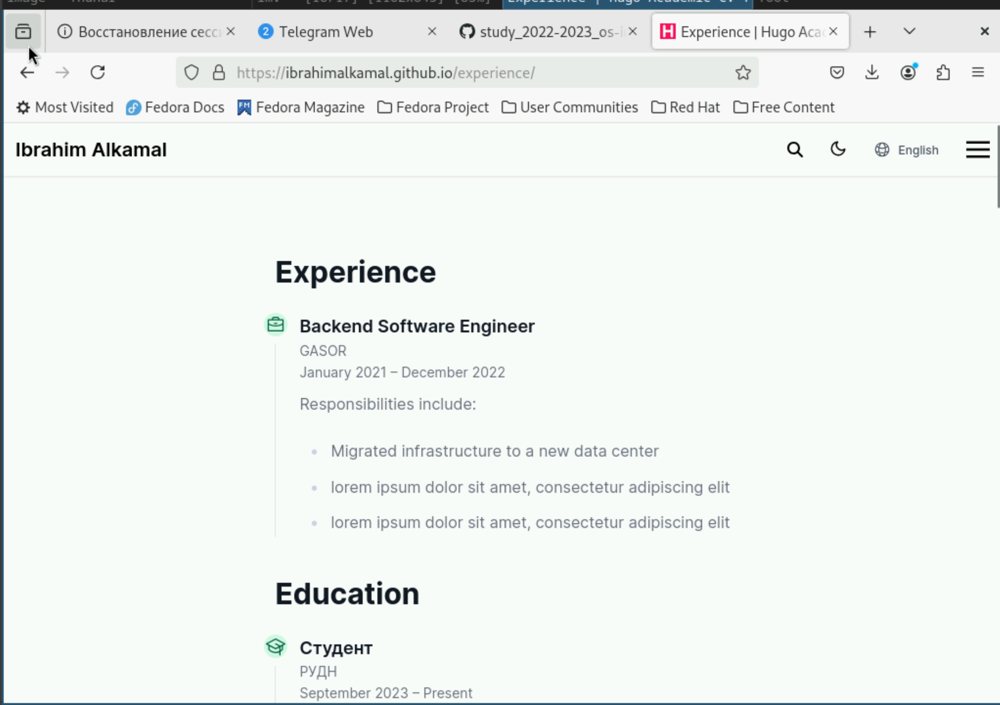

---
## Front matter
lang: ru-RU
title: Этап индивидуального проекта №3
subtitle: Операционные системы
author:
  - Алькамаль Ибрахим
institute:
  - Российский университет дружбы народов, Москва, Россия

date: 6 Сентябрь 2024

## i18n babel
babel-lang: russian
babel-otherlangs: english

## Formatting pdf
toc: false
toc-title: Содержание
slide_level: 2
aspectratio: 169
section-titles: true
theme: metropolis
header-includes:
 - \metroset{progressbar=frametitle,sectionpage=progressbar,numbering=fraction}
 - '\makeatletter'
 - '\beamer@ignorenonframefalse'
 - '\makeatother'
---

## Докладчик

:::::::::::::: {.columns align=center}
::: {.column width="70%"}

  * Алькамаль Ибрахим
  * студентка из группы НКАбд-01-23
  * Факультет физико-математических и естественных наук
  * Российский университет дружбы народов
  * [1032225432@pfur.ru](mailto:1032225432@pfur.ru)
  * <https://ibrahimalkamal.github.io/>

:::
::: {.column width="30%"}

:::
::::::::::::::

## Цель работы

Продолжить работы со своим сайтом. Редактировать его в соответствии с требованиями. Добавить данные о своих достижениях.

## Задание

1. Добавить информацию о навыках (Skills).
2. Добавить информацию об опыте (Experience).
3. Добавить информацию о достижениях (Accomplishments).
4. Сделать пост по прошедшей неделе.
5. Добавить пост на тему по выбору.

## Выполнение проекта

Захожу в терминал, перехожу в директорию ~/work/blog, ввожу команду hugo server для запуска локального сервера

## Выполнение проекта

Перехожу в директорию ~/work/blog/content/en/authors/admin, открываю файл _index.md, в нем будет осуществляться дальшейшая работа

## Выполнение проекта

В блоке features, там, где заголовок Skills прописал навыки.

## Выполнение проекта

Далее добавил свой опыт в блоке Experience, добавил даты, поменял иконки

## Выполнение проекта

Далее в awards добавил достижения

## Выполнение проекта

Добавил пост на тему по выбору (Языки Научного Прогpаммирования) в папке posts

## Выполнение проекта

Добавил пост по прошедшей неделе в папке posts

## Выполнение проекта

Закрываю локальный сервер с помощью клавиш Ctrl+C и собираю сайт с изменениями, введя команду ~/bin/hugo без аргументов

## Выполнение проекта

Отправляю изменения на GitHub

## Выполнение проекта

Сайт:

## Выводы

В процессе выполнения второго этапа индивидуального проекта я научился редактировать данные о себе, а также писать посты и добавлять их на сайт.

